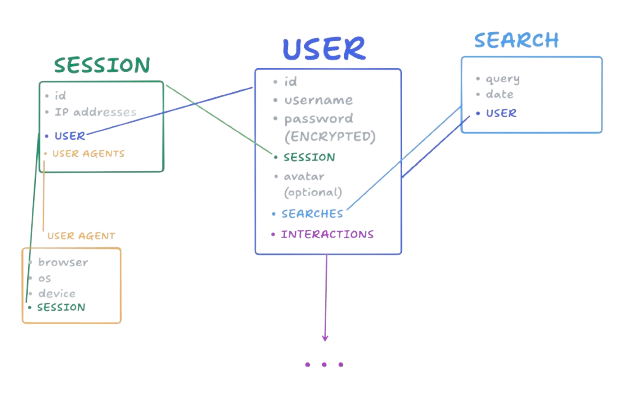

# 乇chord 

While the goal is to be a music cataloging, rating, reviewing, and recommendation web app; Echord also has a fully functional music data interaction API, and no external authentication processes.

- All of the data is stored in a PostgreSQL database, and all interactions are done through the API.
- Authentication is handled through an encrypted JWT token.
- All critical data is encrypted, and all sensitive data is stored in a secure manner.

###### A Next.js application with a PostgreSQL database, and a fully functional API for music data interaction.

- [API](#api)
- [Authentication](#authentication)
  - [User data](#what-data-do-we-store-about-the-user)

---

## API

- We are reliant and integrated with the [Deezer API](https://developers.deezer.com/api) for all music data.
- Upon interactions with music data from the (authorized) client, the data sourced from the Deezer API is cached in our database.
  - Includes relevant data such as album, track, and artist information.
  - Also references the interaction itself, and the user who interacted with the data.
- Only upon **interaction** with the data (music data) is when it is stored in the database along with the interaction/user information.

---

## Authentication

- Authentication is done through an encrypted JWT token, which is stored in a cookie.
- The JWT token is created upon authentication, and is used to authenticate the user for all interactions with the API.

###### What data do we store about the user?

There are many aspects of the application that are not yet implemented, and are planned for future releases.

- The application is in its early stages, and is constantly being updated and improved.
- [Roadmap](./assets/markdown/ROADMAP.md) for more information on the planned features and updates.
- [Interactions](./assets/markdown/INTERACTIONS.md) for more information on the interactions and data storage.

---

## License

This project is licensed under the MIT License - see the [LICENSE](./LICENSE) file for details.

> This project is not affiliated with or endorsed by Deezer. The Deezer API is used for music data interaction, and all data is sourced from the Deezer API. All rights to the music data are owned by their respective owners.

- The application is not intended for commercial use, and is for educational purposes only.
- The application is open source, and is available for anyone to use and contribute to.
- The application is built with the intention of being a music cataloging, rating, reviewing, and recommendation web app.
- The application is also built with the intention of being a music data interaction API, and can be used independently for any data interaction.
