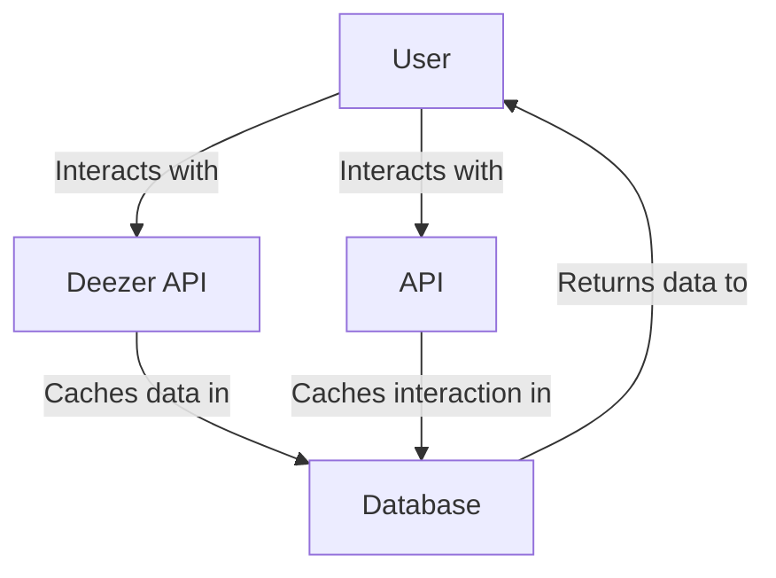

# Interactions 🕹️

- [The process](#the-process)
- [Interaction data](#interaction-data)
  - [Models for data (track/album)](#models-for-data-trackalbum)
- [TL;DR](#tldr)

Interactions are the base of the application and database.

- A **user** & **session** is required to interact with music data.
- The music data is sourced from the [Deezer API](https://developers.deezer.com/api).
- The music data is cached in the database upon interaction.



### The process

- `🔎` A user [searches](https://echord.uk/search/enough%20clxrity) for a track.
  - Or a user clicks on a track from the [home page](https://echord.uk) feed.
- `🖱️` The application sends a request to the Deezer API.
  - The Deezer API returns the search results to the application.
- `⭐` If a user is logged in, they can interact with the track.
- `💾` Upon interaction, the application stores the track/album & interaction data in the database.
- `🌠` The application returns the interaction data to the user on the client-side.

### Interaction data

Data is stored in a PostgreSQL database using Prisma.

There are three essential models for interactions:

- `EInteraction` - The interaction itself.
- `EInteractionData` - The data associated with the interaction.
- `EData` - The data itself (track/album) and its corresponding interaction data.
  <br />
- Every interaction has an `EInteractionType`:
  ```prisma
  enum EInteractionType {
    RATED
    REVIEWED // UNFINISHED
    SAVED
    FAVORITED
    FOLLOWED // UNFINISHED
    UNFOLLOWED // UNFINISHED
    // ... to be continued
  }
  ```

#### Models for data (track/album)

Upon interacting with data, an `ETrack` and `EAblum` is created in the database. The interaction data is then associated with the track/album.

```prisma
model EAlbum {
  id            String   @id @default(cuid())
  albumId       String   @unique
  title         String
  artistName    String
  imageUrl      String?
  averageRating Int?
  eData         EData[]
  interactions  EInteraction[]
  tracks        ETrack[]
  // ...
}
```

> **Notes**:
>
> - The `ETrack` model is similar to the `EAlbum` model, but with additional fields for track-specific data.
> - Every `ETrack` is associated with an `EAlbum`, and every `EAlbum` can contain multiple `ETrack` models.

## TL;DR

- Interactions are what populate the database with music data.
  - Music data is sourced from the Deezer API.
- Interactions are stored in a PostgreSQL database using Prisma.
- You must be logged in to interact with data.
- Interactions are stored in the form of:
  - `EInteraction` - The interaction itself.
  - `EInteractionData` - The data associated with the interaction.
  - `EData` - The data itself (track/album) and its corresponding interaction data.
- Every interaction has an `EInteractionType` (e.g. RATED, REVIEWED, SAVED, etc.).
- Upon interaction, the application stores the track/album & interaction data in the database.
- The application returns the interaction data to the user on the client-side.
